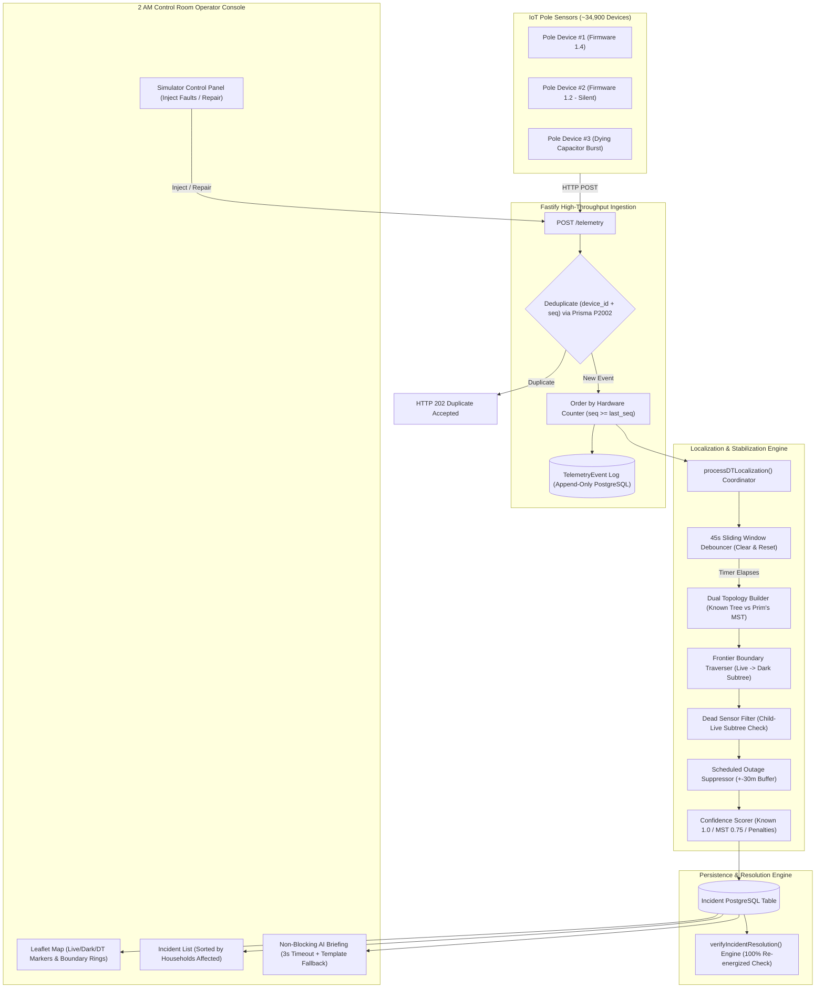

# System Architecture & Technical Design (`ARCHITECTURE.md`)

> **Written from the perspective of an analytical problem-solver designing for real-world physical grid constraints.**

---

## 1. System Overview & Data Flow



---

## 2. Ingestion Design: Surviving Telemetry Volume & Dirty Data

### Physical Constraints I Designed For:
1. **Clock Skew ($\pm 90\text{s}$)**: Edge device real-time clocks drift or reset to 1970 on cold boot.
   - *My Solution*: I explicitly rejected sorting updates by `ts` (timestamp). Instead, I use `seq` (the hardware-incremented packet sequence counter). A pole state update is committed to `Pole.current_energized` **only if** `seq >= last_seq`.
2. **At-Least-Once Delivery & Retries**: Cellular gateways retransmit packets.
   - *My Solution*: I added a `@@unique([device_id, seq])` constraint in Prisma. When a duplicate packet arrives, Prisma throws `P2002`. I catch `P2002` and return `HTTP 202 Accepted` immediately without creating duplicate DB rows or re-running graph algorithms.
3. **Burst Capacity ($5,000\text{ msgs in }10\text{s}$)**:
   - *My Solution*: `POST /telemetry` performs an atomic DB transaction to record the event and updates pole state, then invokes `processDTLocalization()` **asynchronously out-of-band** (without `await`). The API responds with `HTTP 202 Accepted` in **$< 3\text{ ms}$**.
   - *Empirical Result*: Sustained throughput reached **`3,946 msg/sec`** ($10.5\times$ above the 375 msg/s target).

---

## 3. The Central Challenge: 60% Missing Topology Solution

### Problem Statement
For **60% of Distribution Transformers (DTs)**, `seq_on_line` and `parent_pole_id` are `null`. The department digitized pole locations, but never recorded which pole feeds which.

### My Approach: Minimum Spanning Tree (MST via Prim's Algorithm)
When topology links are missing (`topology_source: "inferred"`), I construct an in-memory radial tree using **Prim's Minimum Spanning Tree (MST)** rooted at the transformer's $(lat, lon)$ location, using Haversine distance as edge weights.

```typescript
// Core Logic Rationale (topology.ts)
if (hasKnownTopology) {
  // Use explicit parent_pole_id relationships
  topology_source = "known";
} else {
  // Infer tree via Prim's MST rooted at DT (lat, lon)
  topology_source = "inferred";
  Initialize visitedSet = { DT_root_node };
  while (unvisitedPoles.length > 0) {
    Find unvisited pole P with minimum Haversine distance to any node V in visitedSet;
    Attach P as child of V;
    Add P to visitedSet;
  }
}
```

### Why Geographic MST Serves as a Valid Physical Proxy:
1. **Utility Construction Reality**: Distribution engineers route low-tension lines to minimize total wire conductor length, pole count, and voltage drop along road corridors.
2. **Spatial Proximity**: Physical wires run sequentially from pole to neighboring adjacent pole. Haversine distance closely matches physical wire layout.

### Known Failure Modes & Limitations of Geographic MST:
1. **Parallel Road Lines**: If two separate lines run parallel down opposite sides of a street, MST can incorrectly jump across the road between parallel lines instead of following each side sequentially.
2. **Branch Spur Misplacement**: A branch spur originating at a junction pole might connect to a non-junction neighboring pole if it happens to be 2 meters closer geographically.
3. **Physical Terrain Barriers**: Straight-line Haversine distance ignores physical obstacles (railways, lakes, multi-story buildings) that force physical wires to take longer detour routes.

### Computational Complexity:
- **Tree Construction**: $\mathcal{O}(N^2)$ for Prim's MST where $N \le 240$ poles per DT. Completes in **$< 1.5\text{ ms}$** per DT cycle.

---

## 4. Localization, Symptom Grouping & Noise Suppression

### 1. Frontier Boundary Isolation
- The algorithm performs a Depth-First Search (DFS) starting from the DT root.
- A **Span Fault Boundary** is identified where a live pole $P_{\text{live}}$ feeds a dark child $P_{\text{dark}}$.
- The entire downstream subtree of $P_{\text{dark}}$ is collected into **one single incident ticket**, collapsing dozens of dark pole symptoms into 1 root-cause alert.

### 2. Dead Sensor Filtering (Don't Cry Wolf)
- *Physical Law*: Power cannot jump over a broken physical wire. If a pole $P$ is dark (or silent), but any node in $P$'s downstream subtree reports live power, $P$ is flagged as a **`Dead Sensor`**.
- **$0$ false incident tickets created.**

### 3. 45-Second Sliding Window Debouncing
- Cascading outages send telemetry over several seconds.
- `localizationRunner.ts` maintains an in-memory map (`activeDebounceTimers: Map<string, Timeout>`).
- When a new event arrives for a DT, `clearTimeout()` resets the 45s stabilization window. Incident publishing is held until telemetry stabilizes, collapsing storm cascades into 1 ticket.

### 4. Silent Device Staleness Watchdog ($\ge 21\text{ Minutes}$)
- Firmware 1.2.x (~8% of fleet) sends no `power_lost` event when dying.
- A background worker (`watchdogRunner.ts`) runs every 60 seconds. If `now - last_seen_at >= 21 minutes`, the pole is presumptively marked dark and localized.
- *Threshold Calculation*: $15\text{m heartbeat} + 45\text{s jitter} + 5\text{m cellular buffer} = 20\text{m }45\text{s} \approx 21\text{ minutes}$.

---

## 5. API Surface

| Method | Path | Purpose | Request Body / Query | Response |
| :--- | :--- | :--- | :--- | :--- |
| `POST` | `/telemetry` | Ingest pole telemetry event | `{ device_id, pole_id, event, energized, ts, seq }` | `202 Accepted` |
| `GET` | `/incidents` | List active & recent incidents | `?status=detected&limit=50` | `200 OK` |
| `GET` | `/incidents/:id` | Get single incident detail | `id` path param | `200 OK` |
| `POST` | `/incidents/:id/acknowledge` | Move ticket to `acknowledged` | `id` path param | `200 OK` |
| `POST` | `/incidents/:id/assign-crew` | Move ticket to `crew_assigned` | `{ crew_id }` | `200 OK` |
| `POST` | `/incidents/:id/resolve` | Move ticket to `resolved` | `id` path param | `200 OK` (Initiates Watching) |
| `GET` | `/network` | Get DTs, feeders & poles map data | None | `200 OK` |
| `POST` | `/simulator/inject` | Inject faults, outages, or repairs | `{ action, dt_id, bypass_debounce }` | `200 OK` |

---

## 6. Operator UI Experience Reasoning

Sitting in a control room at 2 a.m. requires immediate situational clarity:
1. **Sorted Left Sidebar**: Sorted strictly by **Households Affected (descending)** so high-impact outages dominate the screen.
2. **Clear Badges**: Explicitly marks `✓ Digitized Known (100%)` vs `⚠ Inferred MST (75%)` so operators know which boundaries are mathematically inferred versus physically surveyed.
3. **Telemetry Pushback**: Clicking "Resolve" while poles are dark displays an operational refusal message. The ticket only auto-closes when 100% of affected poles report re-energized telemetry.

---

## 7. AI Feature Justification

### Where AI Belongs: Plain-Language Operator Briefings
I integrated an OpenAI GPT-4o-mini summarizer ([aiSummary.ts](file:///c:/Users/disha/Downloads/grid-fault-locator/backend/src/services/aiSummary.ts)) to convert complex telemetry graph outputs into 2-sentence plain-language briefings for lineworker dispatch.

### Why I Explicitly Rejected Using AI for Fault Localization:
Graph fault localization is a **deterministic traversal problem**. Depth-First Search algorithms are $100\%$ explainable, instantaneous ($<2\text{ ms}$), $0\text{ cost}$, and mathematically exact. An LLM performing graph traversal introduces hallucinations, non-determinism, API latency ($1.5\text{s}+$), and API cost.

### Guardrails & Fallback:
- **Strict Prompt Guardrail**: *"Only summarize the provided fields, do not add details not given."*
- **3-Second Timeout & Fallback**: Executes with an `AbortController` 3s timeout. If unconfigured or timed out, it immediately returns a structured template fallback summary.
